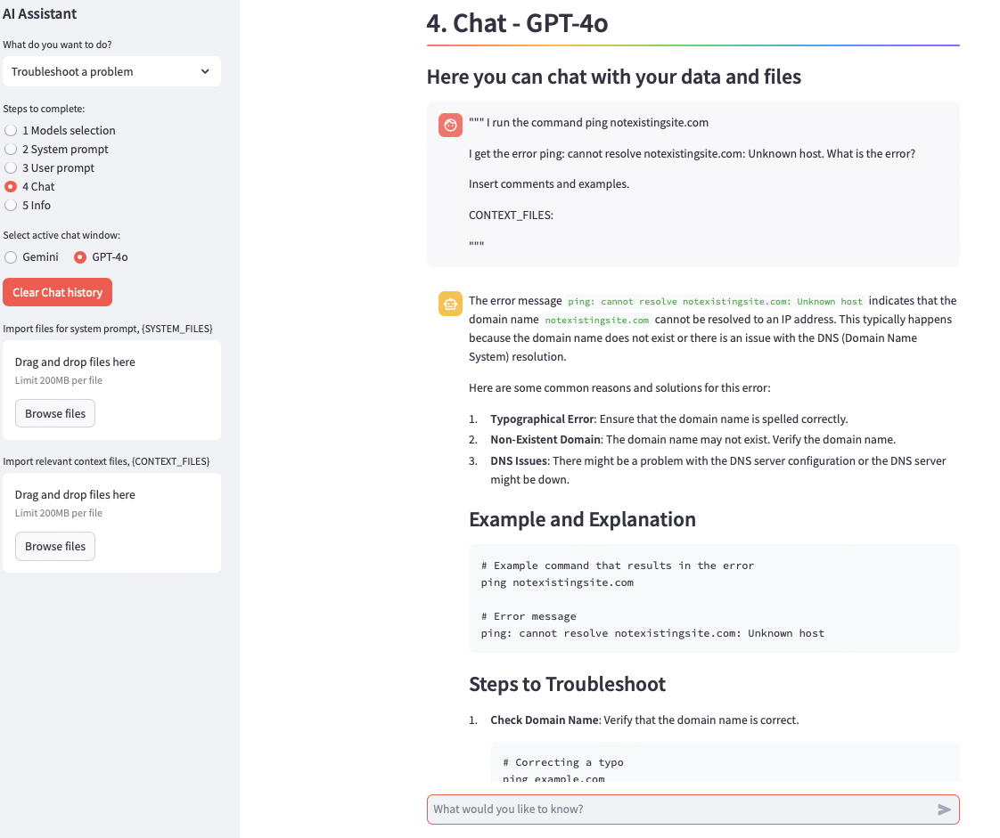

# AI Assistant

This AI Assistant can help with code debugging, auditing and quality, coding, writing documents, etc. It uses multiple LLM models to improve predictions and reduce hallucinations. This example uses Gemini 1.5 Flash and OpenAI GPT-4o, but the models can be switched. By using the wide context window of these models, we can reduce the use of RAG. Special attention has been paid to the fact that the user can modify the system and user prompts and use prompt templates.

The application is simple based on Python and Streamlit and can easily be extended for other use cases like code generation etc.

The usage follows the following steps:

1) Select the LLM Models and define their parameters


2) Check the system prompt or define your own custom prompt


3) You may define an User prompt using a prompt template


4) Now you chat with your documents. Gemini's answer


5) GPT-4o answer



## Setup

Variables that need to be defined .env file (you may copy these from .env.sample)

```console
GEMINI_PROJECT  =
GEMINI_LOCATION  =  
GEMINI_MODEL  =  "gemini-1.5-flash"
OPENAI_API_KEY  =
GPT_MODEL  =  "gpt-4o-2024-05-13"
```
## Local environment

Create a new virtual environment 
```console
python -m venv .venv
source .venv/bin/activate
pip install -r requirements.txt
```
Clone the repository

```console
git clone https://github.com/MLConvexAI/AI-Assistant.git
```
You can run the code locally as

```console
streamlit run app.py
```

The page can be found from

Local URL: http://localhost:8501

## Cloud

The solution can also be easily deployed to the cloud using a container and a Dockerfile.
